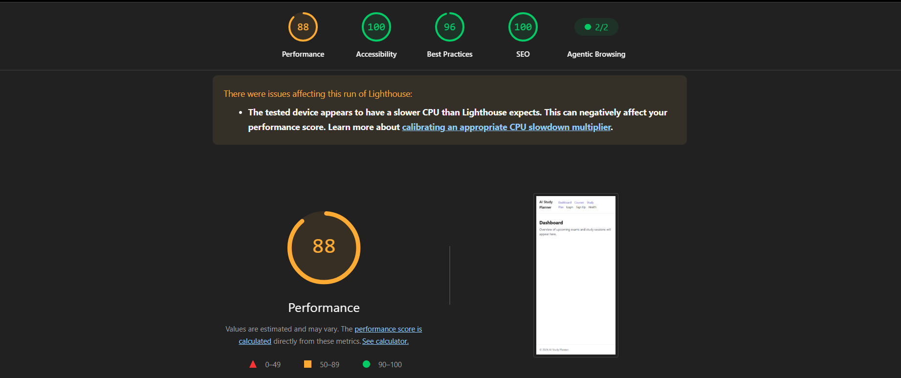
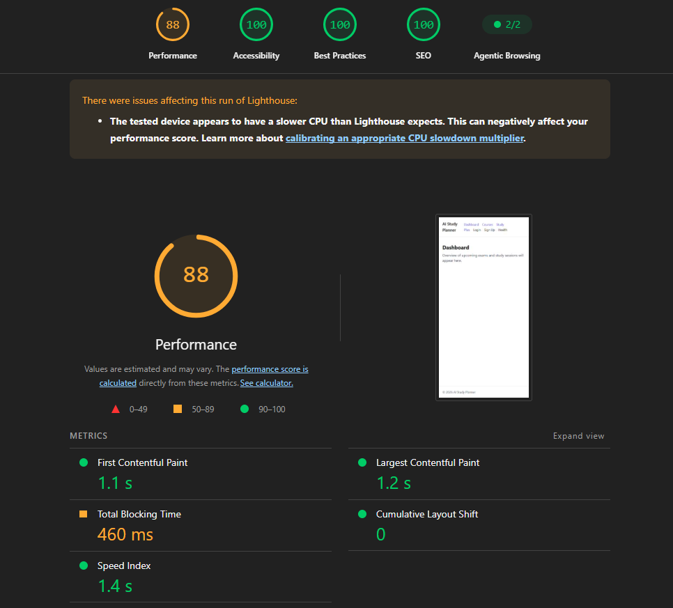
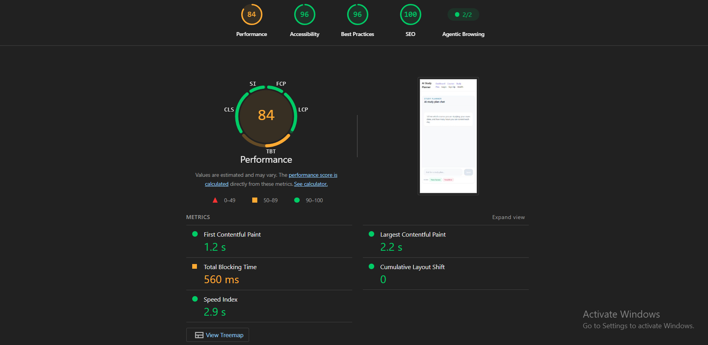
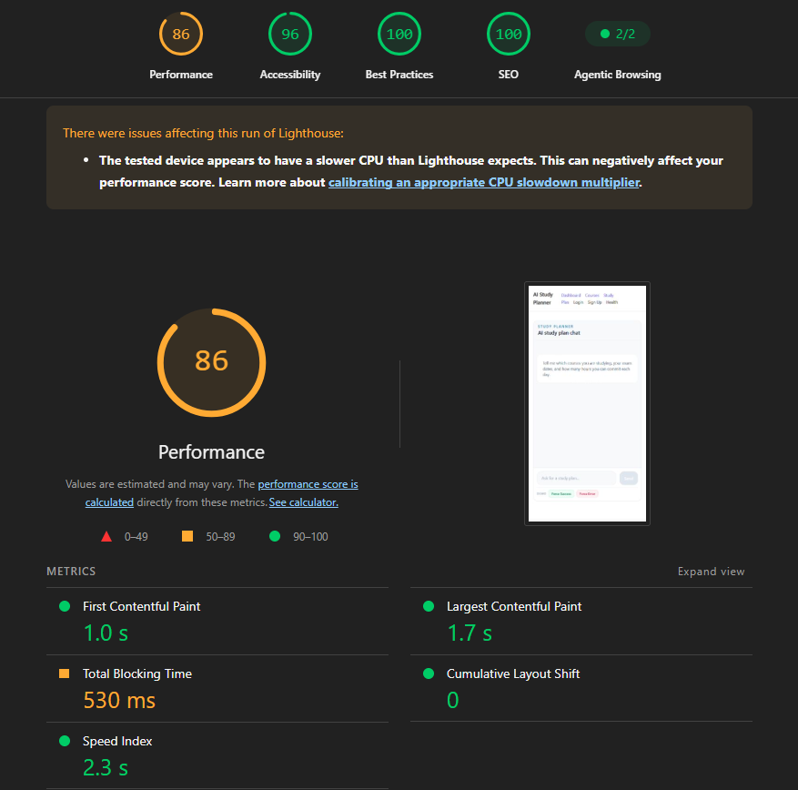

# FlyRank Capstone

A capstone project for the FlyRank Front-end AI Engineering track.

## Overview

FlyRank Capstone is a full-stack web application built with React and Next.js 
(frontend) and Node.js (API). It demonstrates front-end AI engineering skills 
through AI-assisted UI development and modern React/Next.js practices.

**Status:** Early development - project scaffold in place.

## Tech Stack

- **Frontend:** React, Next.js, TypeScript
- **Backend:** Node.js

## Tool Contract

### `generateStudySchedule`

**Purpose:** Generates a day-by-day study schedule for a course, cycling through the given topics up to the exam date.

**Location:** `lib/tools/study-schedule.ts`

**Input schema:**

| Field | Type | Description |
|---|---|---|
| `courseName` | `string` | The full course name or subject being studied, e.g. "Biology 101". |
| `examDate` | `string` | The exam date in `YYYY-MM-DD` format. Must be a future date. |
| `topics` | `string[]` | A list of specific subject areas or topics to cover before the exam. |
| `hoursPerDay` | `number` | Daily study time in hours, between 0.5 and 12 inclusive. |

**Return shape:**

```ts
{
  courseName: string;
  examDate: string;
  daysUntilExam: number;
  totalHours: number;
  days: {
    date: string;
    topic: string;
    hours: number;
  }[];
}
```

**Validation / error cases:**
- Throws if `examDate` is not a valid date, or is today or in the past.
- Throws if `topics` is empty.

**UI rendering:** The tool's four lifecycle states (`input-streaming`, `input-available`, `output-available`, `output-error`) are rendered with distinct visual treatments in `app/study-plan/page.tsx` via the `StudyScheduleToolPart` component. A successful call renders as a day-by-day table with a summary header (exam date, total hours, days remaining). A failed call renders as a designed error card showing the validation message.


---

## Environment Variables

Copy `.env.local.example` to `.env.local` and fill in the values before running the development server.

| Variable | Required | Description | How to obtain |
|---|---|---|---|
| `GOOGLE_GENERATIVE_AI_API_KEY` | **Required** | API key for the Google Gemini model used by the AI study planner chat (`gemini-flash-latest`). | Create a key at [aistudio.google.com/apikey](https://aistudio.google.com/apikey) |
| `NEXT_PUBLIC_APP_NAME` | Optional | Display name used for the application (defaults to `AI Study Planner`). | Set to any string, e.g. `AI_STUDY_PLANNER`. |

> **Never commit `.env.local` to version control.** It is listed in `.gitignore`. The `.env.local.example` file is committed as a reference template with no real secrets.

---

## Production Hygiene & Architecture

### Route protection

The AI chat route (`app/api/chat/route.ts`) includes three layers of production hardening applied before requests reach the model:

| Protection | Behaviour |
|---|---|
| **Vercel `maxDuration`** | `export const maxDuration = 30` caps the serverless function lifetime to 30 seconds. Without this, long-running streams can exceed the platform default and be silently killed, leaving the client with an incomplete response. |
| **IP rate limiting** | 10 requests per IP per 60-second sliding window. Excess requests receive a `429 Too Many Requests` JSON response with a `Retry-After: 60` header. Client IP is resolved from `x-forwarded-for` (Vercel proxy header), falling back to `x-real-ip`, then `"anonymous"`. |
| **Input length guard** | Any user message part exceeding 2,000 characters receives a `400 Bad Request` JSON response immediately, before the request is forwarded to the model. This prevents oversized prompts from consuming quota or violating the `maxDuration` budget. |

### Serverless limitations (in-memory rate limiter)

The rate limiter uses a plain `Map<string, number[]>` in the Node.js process heap. This is intentional for single-instance free-tier deployments:

- **Cold starts reset the map.** Every new function instance starts with an empty rate-limit state.
- **Multiple instances do not share state.** If Vercel scales beyond one function instance, each maintains its own independent map.

**For production scale**, replace `rateLimitMap` with a distributed store:
- [Upstash Redis](https://upstash.com/) via `@upstash/ratelimit` — purpose-built sliding-window rate limiter with edge support.
- [Vercel KV](https://vercel.com/docs/storage/vercel-kv) — managed Redis compatible with Vercel's deployment model.

### Technical architecture summary

| Layer | Technology | Notes |
|---|---|---|
| **Routing** | Next.js 13 App Router | File-based routing under `app/`. Server Components for pages; Client Components only where interactivity is required (`"use client"`). |
| **AI streaming** | Vercel AI SDK (`ai`, `@ai-sdk/react`, `@ai-sdk/google`) | `streamText` on the server; `useChat` with `DefaultChatTransport` on the client. UI message stream protocol handles partial tool calls and text deltas. |
| **Tool validation** | Zod (via AI SDK) | `generateStudySchedule` input is validated with a Zod schema in `lib/tools/study-schedule.ts`. Invalid inputs throw at the tool layer and surface as `output-error` tool parts in the UI. |
| **Styling** | Tailwind CSS | Utility-first. All motion states (idle/hover/loading/success/error/disabled) on `SendButton` are implemented with `focus-visible:ring-*` focus rings and `prefers-reduced-motion` compatibility. |
| **Testing** | Vitest + React Testing Library | Unit tests in `tests/`. `npm test` runs Vitest; `npm run test:run` for CI. |
| **CI** | GitHub Actions | `.github/workflows/test.yml` runs Vitest on every push and pull request. |

---

## Key Architectural Decisions

- **Streaming Architecture over Polling:** Utilized Vercel AI SDK UI message streaming (`streamText` + `DefaultChatTransport`) to deliver sub-second time-to-first-token (TTFT) and real-time tool state transitions, avoiding latency and server overhead from client polling.
- **Client-Boundary Isolation:** Decoupled `StudyScheduleToolPart` from the core chat feed into an independent presentation component. This isolates tool lifecycle rendering (`input-streaming`, `input-available`, `output-available`, `output-error`) and avoids unnecessary re-renders of the parent message list.
- **In-Memory Defensive Hygiene:** Opted for process-level sliding-window rate limiting (10 req/min) and an immediate 2,000-character payload ceiling directly in the route handler. This provides instant protection against automated credit-draining attacks on the free tier without adding external database dependencies like Redis.
- **Strict Schema-Level Tool Validation:** Implemented parameter verification inside the Zod schema (`lib/tools/study-schedule.ts`) rather than relying on LLM prompt adherence. This guarantees that malformed inputs trigger structured `output-error` UI states deterministically.

---

## How AI Tools Built This

- **Tooling Stack:** Developed using Antigravity (Claude 3.5 Sonnet / Opus) paired with VS Code and GitHub Copilot for code scaffolding, type modeling, and defensive test suite generation.
- **Prompt Iteration & Tool Engineering:** System prompts and Zod tool schemas were iteratively tested to constrain the model to structured outputs, handle edge-case dates (past dates, leap years, non-consecutive study days), and enforce brief conversational responses.
- **Accessibility & Motion Polish (FE-10):** AI assistance was used to implement WCAG AA contrast tokens, manage multi-state `focus-visible` rings on interactive elements, and engineer reduced-motion fallbacks for loading animations.
- **Production Hardening:** Scaffolding the sliding-window IP rate limiter and defensive payload guards with inline edge-case documentation.

---

## Lighthouse Audits & Performance Verification

Lighthouse verification runs demonstrating production performance, accessibility, best practices, and SEO compliance across key routes:

### Dashboard Route (`/`)
| Metric Run | Screenshot | Scores |
|---|---|---|
| **Before Optimization** | `before-home.png` | **88** Performance · **100** Accessibility · **96** Best Practices · **100** SEO |
| **After Production Hardening** | `after-home.png` | **88** Performance · **100** Accessibility · **100** Best Practices · **100** SEO |

#### Visual Evidence
**Before Optimization (Dashboard):**


**After Production Hardening (Dashboard):**


---

### Study Plan Route (`/study-plan`)
| Metric Run | Screenshot | Scores |
|---|---|---|
| **Before Optimization** | `before-study-plan.png` | **84** Performance · **96** Accessibility · **96** Best Practices · **100** SEO |
| **After Production Hardening** | `after-study-plan.png` | **86** Performance · **96** Accessibility · **100** Best Practices · **100** SEO |

#### Visual Evidence
**Before Optimization (Study Plan):**


**After Production Hardening (Study Plan):**
